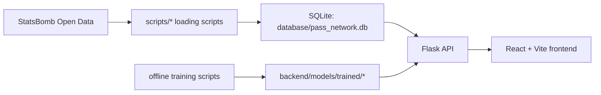

# Architecture Overview

## Purpose

Tactix transforms match event data into passing-network intelligence and interprets it across three layers:

1. Data layer: StatsBomb JSON -> SQLite
2. Analysis layer: graph metrics + pattern detection + ML-assisted interpretation
3. Presentation layer: React screens, reports, and comparison views

## System Components

| Layer | Technology | Primary Responsibility |
| --- | --- | --- |
| Frontend | React 18, Vite, TypeScript, Axios, D3, jsPDF | Screens, match selection, analysis triggering, visualization, export |
| Backend API | Flask, Flask-CORS | Match, team, player, and analysis endpoints |
| Analysis Services | Pandas, NetworkX, custom ML/service classes | Pass network construction, metrics, pattern detection, counter-tactic generation |
| Data Layer | SQLAlchemy, SQLite | Persistence for matches, events, passes, players, teams, and metrics |
| Offline ML | Python training scripts, joblib, some PyTorch-based training code | Model training and artifact generation |
| External Data | StatsBomb Open Data | Match, event, and lineup source data |

## High-Level Flow

## User Flow

### 1. Data preparation

- `scripts/download_statsbomb_data.py` downloads the StatsBomb open-data repository.
- `scripts/load_sample_data.py`, `scripts/load_full_season.py`, or `scripts/load_season.py` writes raw data into SQLite.

### 2. Running the application

- The Flask backend runs on port `5001`.
- The Vite dev server runs on port `3000`.
- The frontend proxies `/api` requests to the backend.

### 3. Analysis request

- The user selects a match or team.
- The frontend calls the relevant endpoint.
- The backend reads pass/event records from the database.
- The service layer builds networks, computes metrics, detects patterns, and generates recommendations.
- Results are returned to the frontend as JSON.

## Folder Responsibilities

| Path | Responsibility |
| --- | --- |
| `backend/api/` | HTTP route definitions |
| `backend/models/` | SQLAlchemy models and trained model artifacts |
| `backend/services/` | Domain logic and analysis services |
| `backend/services/ml/` | ML pipeline and model classes |
| `frontend/src/pages/` | Page-level screens |
| `frontend/src/components/` | UI components |
| `frontend/src/services/` | Axios-based API clients |
| `scripts/` | Data loading, model training, and operational helpers |
| `database/` | SQLite database and init scripts |
| `data/raw/` | Raw StatsBomb data |

## Architectural Characteristics

### Strengths

- The domain is reasonably clear: acquisition, analysis, and presentation are separated.
- Network analysis and ML-enhanced analysis operate on the same underlying data model.
- Frontend screens are divided by analysis use case.

### Limitations

- The backend is synchronous and performs heavy computation inside request handlers.
- Standard analysis and ML analysis do not expose identical API contracts.
- There are gaps between the persistent DB model and the runtime production flow.

## Acceptance Check

After reading this document, a new contributor should understand:

- how the frontend and backend communicate
- how data flows from the raw source into the UI
- which folders contain production code and which contain support scripts
